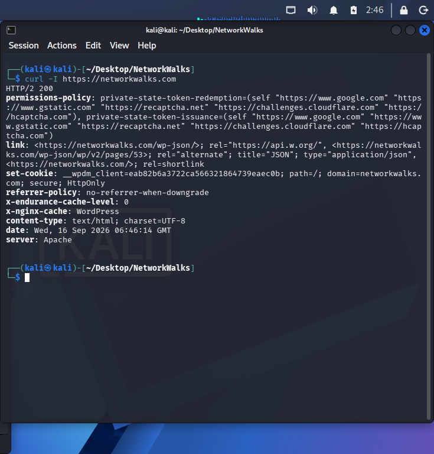
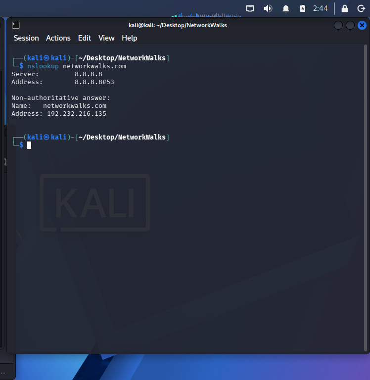
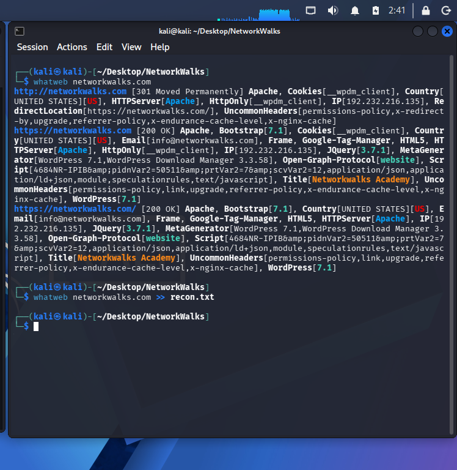
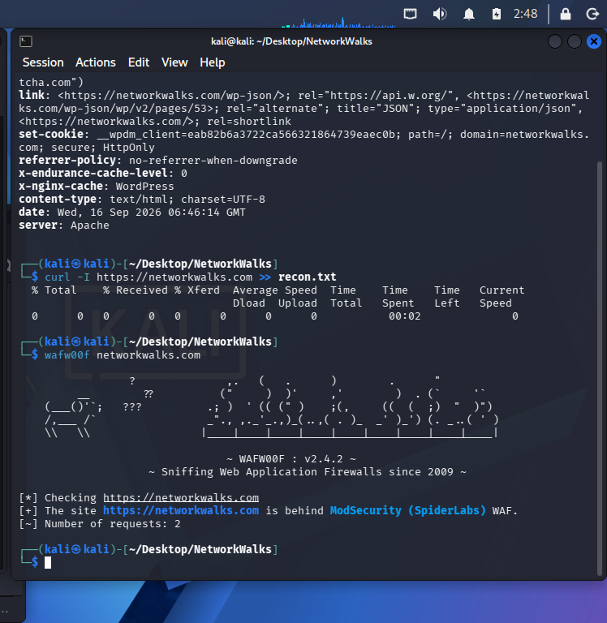
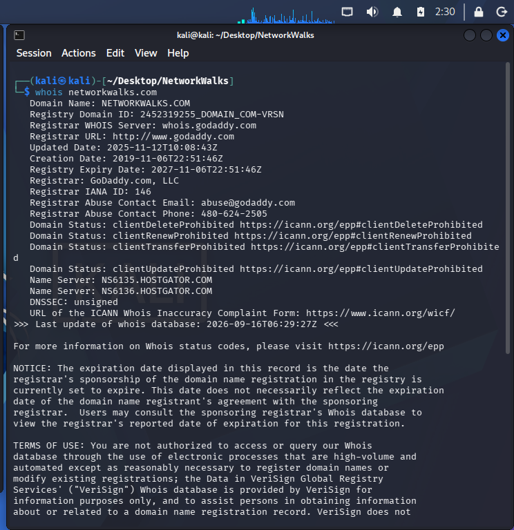
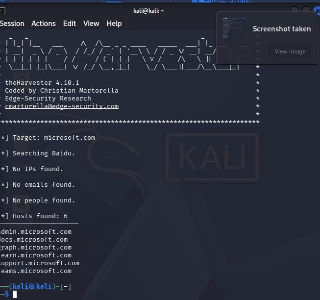
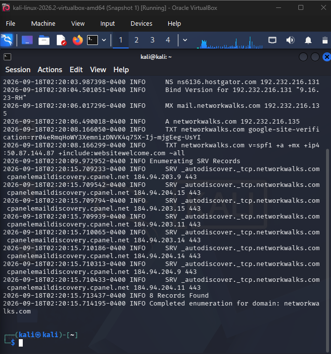
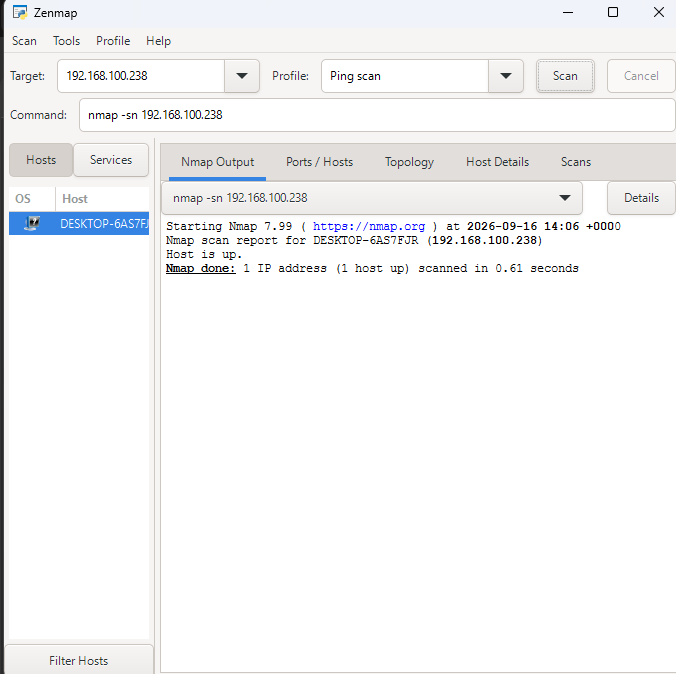

# 🔐 Penetration Testing Report

## Footprinting, Reconnaissance & Network Scanning

**Program:** Networkwalks Cybersecurity Internship
**Batch:** B082
**Week:** 02
**Pentester:** Adzido Godsway
**Date:** September 2026

## 1. Overview

This practical covered **footprinting, reconnaissance, OSINT and network scanning** using several cybersecurity tools.

The activities focused on gathering information from publicly available sources and scanning my own machine/network where applicable. No exploitation was performed.

---

## 2. Authorization & Scope

All activities were performed within an **authorized scope**.

Written permission was obtained from the relevant client networkwalks.com before conducting reconnaissance activities against the client's domain. Activities involving network scanning were performed on my **own machine and local network**.

The Google Hacking Database activities involved searching for information that was already publicly indexed by search engines. No attempt was made to gain unauthorized access to the discovered devices or files.

The testing was limited to the assigned practical exercises, and no exploitation, credential attacks, or unauthorized access was performed.

---

### Activities Completed

1. Footprinting a domain using multiple Kali Linux tools (whois, whatweb, nslookup, wafw00f, dnsrecon, curl -I)
2. Finding publicly indexed information using Google Hacking Database (Google Dorking)
3. Maltego for finding information linked to a particular email address
4. theHarvester reconnaissance
5. Zenmap network scanning

---

## 3. Tools Used

| Tool                    | Purpose                                                        |
| ----------------------- | -------------------------------------------------------------- |
| WHOIS                   | Domain registration and ownership information                  |
| WhatWeb                 | Web technologies running a web                                 |
| Nslookup                | Domain-to-IP resolution                                        |
| cURL                    | HTTP response header inspection                                |
| Wafw00f                 | Web Application Firewall detection                                                  |
| DNSRecon                | DNS record enumeration                                         |
| Google Hacking Database | OSINT and advanced search-engine queries.                         |
| Maltego                 | Relationship and email reconnaissance                          |
| theHarvester            | Collection of emails, subdomains and hosts from public sources |
| Zenmap                  | Network and port scanning                                      |

---

# 4. Footprinting & Reconnaissance

## 4.1 Multiple Kali Linux Tools

I used several Kali Linux tools to collect publicly available information about a target domain.

### WHOIS

WHOIS was used to obtain publicly available domain registration information, including registration details and name servers.

**Purpose:** Understand the domain's registration and infrastructure information.

---

### WhatWeb

WhatWeb was used to fingerprint the technologies used by the website.

The results provide information about the web technologies and their exact version.

**Results:** Apache, Bootstrap[7.1.1] Frame, Google-Tag-Manager, HTML5, HTTPServer[Apache], IP[192.232.216.135], JQuery[3.7.1], MetaGenerator[WordPress 7.1.1,WordPress Download Manager 3.3.58],

---

### Nslookup

Nslookup was used to resolve the target domain and identify its associated IP address.

**Result:** 192.232.216.135

---

### cURL

I used `curl -I` to inspect the HTTP response headers returned by the website.

**Result:** set-cookie: __wpdm_client=9b260de8e67464e49e72bb2d0a37ee61; path=/; domain=networkwalks.com; secure; HttpOnly
referrer-policy: no-referrer-when-downgrade
x-endurance-cache-level: 0
x-nginx-cache: WordPress
content-type: text/html; charset=UTF-8
date: Fri, 18 Sep 20

---

### Wafw00f

Wafw00f was used to determine whether a Web Application Firewall was present.

**Result:** ModSecurity (SpiderLabs)
---

### DNSRecon

DNSRecon was used to enumerate publicly available DNS records.

The enumeration provided information such as name servers, mail servers and other DNS-related records.

**Purpose:** Build a broader picture of the target's publicly exposed DNS infrastructure.

---

# 5. Google Hacking Database

The second activity involved using the **Google Hacking Database (GHDB)** and Google search operators for passive reconnaissance.

The objective was to discover publicly indexed information without directly interacting with the target systems.

### Activities Performed

* Identified publicly accessible security camera interfaces indexed by search engines.
* Recorded and verified ten accessible camera links for the practical exercise.
* Identified ten downloadable mathematics e-books in PDF format.
* Recorded the relevant search results and URLs as evidence.

The exercise focused on discovery and verification of publicly indexed results. No attempt was made to gain unauthorized access to the discovered systems.

---

# 6. Maltego

I used **Maltego** as an OSINT tool to investigate publicly available information associated with networkwalks.com domain.

The practical focused on identifying **email addresses associated with the domain** and visualizing relationships between the collected information.

**Purpose:** Demonstrate how publicly available information can be connected to build an organization's digital footprint.

---

# 7. theHarvester

I used **theHarvester** on Kali Linux to collect publicly available information on networkwalks.

The tool can gather information such as:

* Email addresses
* Subdomains
* Hostnames
* Employee names
* IP addresses
* Other publicly available information

### Target: networkwalks.com

I first searched for **email addresses and subdomains associated with networkwalks.com** using the **Baidu** source with a result limit of **1,000**.

I then performed another reconnaissance search using all available public sources with a result limit of **50**.

This shown how information from different public sources can be combined to build an organization's external footprint.

---

# 8. Zenmap Network Scanning

For the final activity, I used **Zenmap (Nmap GUI)** to perform network and port scanning on my own machine/network.

The scan was performed in my own authorized environment.

### Network Information

* **Target:** My own machine
* **Network:** Local network
* **IP Address:** `192.168.100.238`
* **MAC Address:** `52:54:00:12:35:00`

Zenmap was used to identify the host and inspect the available network ports.

---

# 9. Key Findings

| Activity       | Main Finding                                                           |
| -------------- | ---------------------------------------------------------------------- |
| WHOIS          | Domain registration and name-server information was publicly available |
| WhatWeb        | Web technologies could be fingerprinted                                |
| Nslookup       | Domain could be resolved to an IP address                              |
| cURL           | HTTP response headers were accessible                                  |
| Wafw00f        | A Web Application Firewall could be detected                                                |
| DNSRecon       | Multiple DNS records were publicly discoverable                        |
| Google Hacking | Publicly indexed devices and files could be discovered                 |
| Maltego        | Email information could be associated with a domain                    |
| theHarvester   | Public email addresses, subdomains and hosts could be collected        |
| Zenmap         | My local machine/network could be scanned for open ports               |

---

# 10. Security Lessons

The practical exercises demonstrated that a significant amount of information can be collected **before attempting any exploitation**.

Key lessons learned include:

* Publicly available information can reveal details about an organization's infrastructure.
* Web technologies can often be fingerprinted remotely.
* DNS records provide useful information about an organization's infrastructure.
* Search engines can index sensitive or unintended public resources.
* OSINT tools can correlate information from multiple public sources.
* Network scanners can identify hosts and exposed services.
* Reconnaissance should always remain within an authorized scope.

---

# 11. Conclusion

During Week 2 of the Networkwalks Cybersecurity Program, I completed practical exercises covering **footprinting, reconnaissance, OSINT and network scanning**.

I used multiple Kali Linux tools, Google Hacking Database techniques, Maltego, theHarvester and Zenmap to understand how security professionals gather information about systems and organizations.

The activities reinforced an important penetration-testing concept: **reconnaissance comes before exploitation**. Understanding what information is publicly exposed and what services are reachable helps security professionals identify areas that require further security assessment.

All testing involving systems or networks was performed within an authorized scope.

## 📸 Evidence

Screenshots and supporting evidence for each activity are included in the `Screenshots/` directory.

.png)

